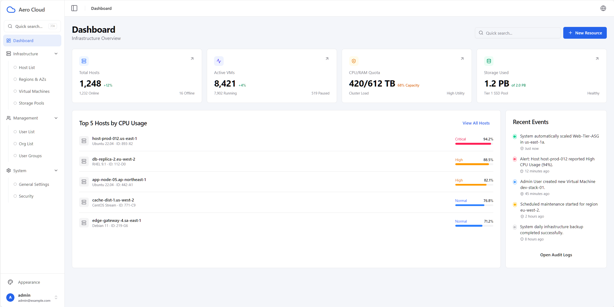
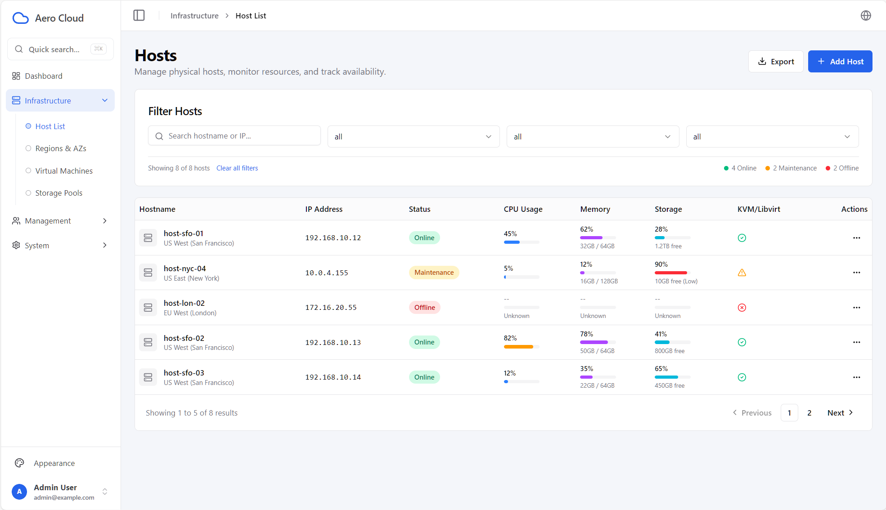
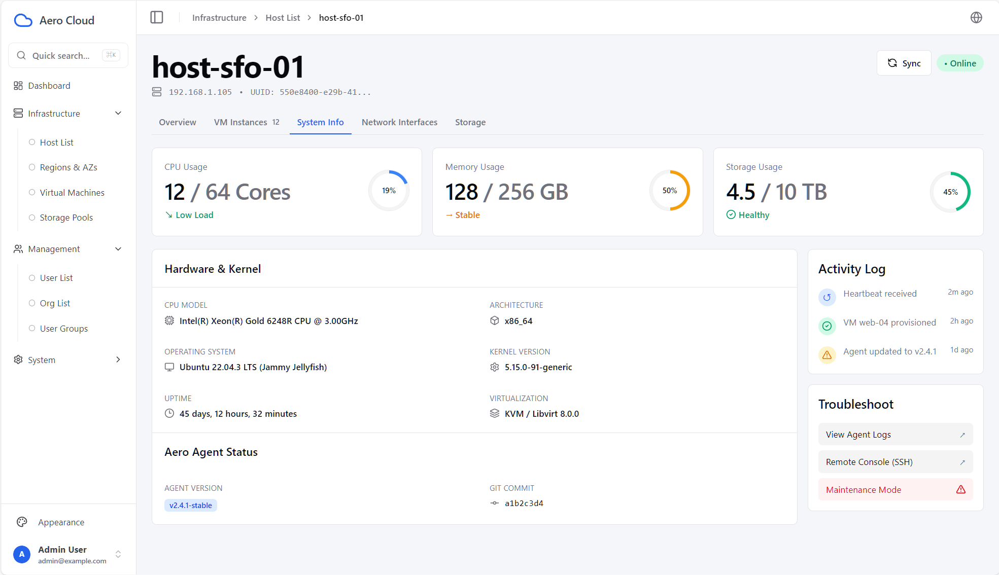
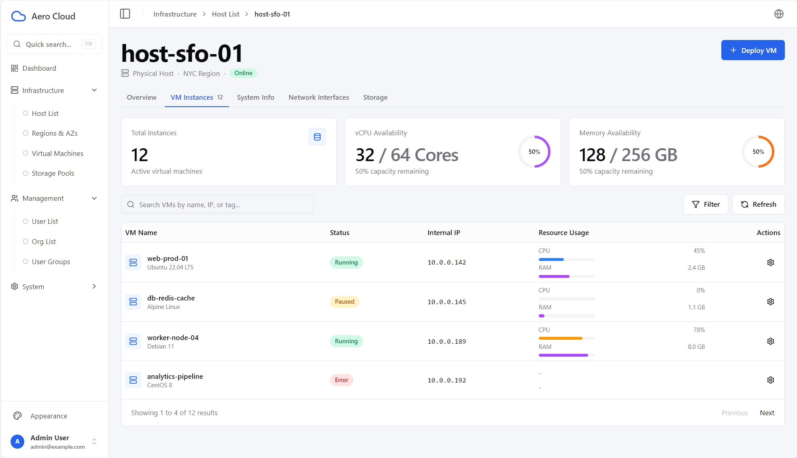
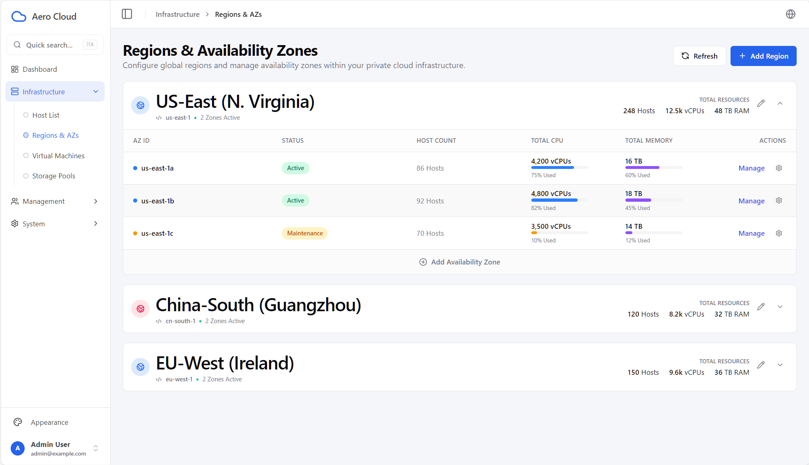
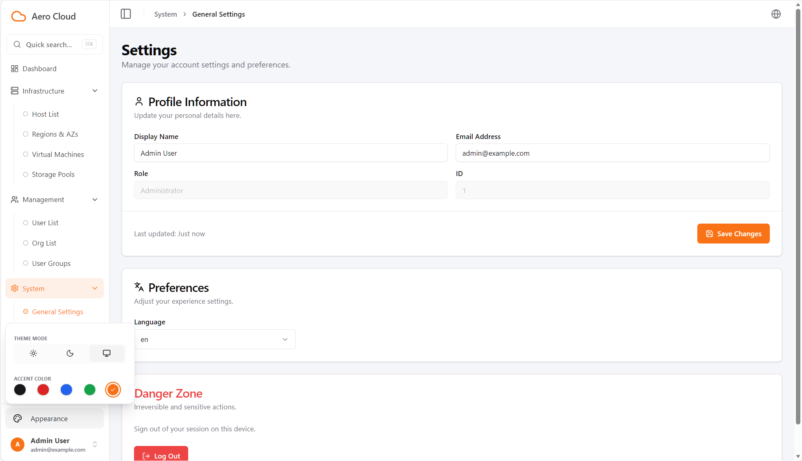

# Aero Cloud Admin Template

[English](./README.md) | 简体中文

基于 **React 19 + TypeScript + Vite + Tailwind CSS** 的后台管理模板工程，包含认证路由、主题系统、国际化、快捷搜索、分页列表与基础 API 封装。

## 项目定位

- 可直接作为中后台前端脚手架使用
- 默认内置一套完整示例页面（Dashboard / Hosts / Regions & AZs / Users / Orgs / Settings）
- 保留扩展点，方便替换为真实后端 API

## 界面预览

### 1. Dashboard 首页



### 2. Hosts 列表



### 3. Hosts 详情/列表扩展示例



### 4. Host Detail 页面示例



### 5. Regions & AZs



### 6. 快捷搜索（Command Palette）


### 7. 主题与外观设置



## 核心能力

- 认证与路由守卫：未登录自动跳转 `/login`，401 自动清理会话并跳转登录
- API 访问层：统一 axios 实例、错误标准化、分页响应类型
- 国际化：`en` / `zh-CN`，含开发期 key 差异检查与缺失 key 告警
- 主题系统：`light / dark / system` + 5 种强调色
- 快捷搜索：`⌘K` / `Ctrl+K` 打开全局命令面板
- 列表能力：通用分页 hook，支持搜索/筛选/分页
- 工程质量：ESLint + TypeScript 严格校验 + Vitest 测试基线

## 技术栈

- React 19.2
- TypeScript 5.9
- Vite 7.3
- Tailwind CSS 4
- React Router DOM 7
- Zustand 5
- Axios
- react-i18next / i18next
- Vitest + Testing Library

## 快速开始

### 1. 环境要求

- Node.js >= 20
- pnpm >= 8

### 2. 安装与启动

```bash
pnpm install
pnpm run dev
```

默认访问：`http://localhost:5173`

### 3. 常用命令

```bash
pnpm run dev         # 启动开发环境
pnpm run build       # 构建产物（tsc + vite build）
pnpm run preview     # 预览构建结果
pnpm run lint        # ESLint 检查
pnpm run test        # Vitest 单测
pnpm run test:watch  # Vitest 监听模式
pnpm exec tsc -b     # TypeScript 项目引用构建检查
```

## 环境变量说明

复制模板：

```bash
cp .env.example .env
```

变量如下：

- `VITE_API_BASE_URL`：API 基础路径，默认 `/api`
- `VITE_ROUTER_MODE`：路由模式，`hash` 或 `browser`，默认 `hash`
- `VITE_APP_BASENAME`：应用部署子路径（如 `/admin`），默认空
- `VITE_USE_MOCK_AUTH`：是否使用前端 mock 登录，默认 `true`

## 后端接口约定（当前实现）

### 成功响应

- Body 直接返回业务数据

### 错误响应

```json
{ "code": 1001, "msg": "error message" }
```

### 分页响应

```json
{
  "total": 100,
  "page_num": 1,
  "page_size": 10,
  "data": []
}
```

前端已提供：

- `PageResponse<T>` 类型
- `apiClient.getPage<T>()`
- `toPaginatedResult()` 适配函数（将后端分页结构转成前端统一列表模型）

## 路由概览

- `/login`
- `/`
- `/infrastructure/hosts`
- `/infrastructure/hosts/:hostId`
- `/infrastructure/regions-azs`
- `/management/users`
- `/management/orgs`
- `/system/settings`

占位路由（目前为 NotFound 页面）：

- `/infrastructure/vms`
- `/infrastructure/storage-pools`
- `/management/groups`
- `/system/security`

## 目录结构（关键部分）

```text
src/
├── api/
│   ├── axios.ts
│   ├── client.ts
│   ├── error.ts
│   ├── types.ts
│   └── modules/
│       └── auth.ts
├── auth/
│   └── session.ts
├── components/
│   ├── AppErrorBoundary.tsx
│   ├── Layout.tsx
│   ├── Sidebar.tsx
│   ├── ThemeController.tsx
│   └── ui/
├── config/
│   ├── app.ts
│   └── router.ts
├── hooks/
│   ├── use-data-table.ts
│   └── use-mobile.ts
├── i18n/
│   ├── index.ts
│   ├── dev-check.ts
│   └── locales/
├── lib/
│   ├── routes.tsx
│   ├── pagination.ts
│   └── utils.ts
├── pages/
├── store/
│   └── useStore.ts
├── theme/
│   └── palette.ts
└── test/
```

## React Compiler 说明

项目 `vite.config.ts` 已预留 React Compiler 接入逻辑：

- 若安装 `babel-plugin-react-compiler`，将自动启用
- 若未安装，不会阻塞项目运行

安装命令示例：

```bash
pnpm add -D babel-plugin-react-compiler
```

## License

MIT License，详见 [LICENSE](./LICENSE)。
